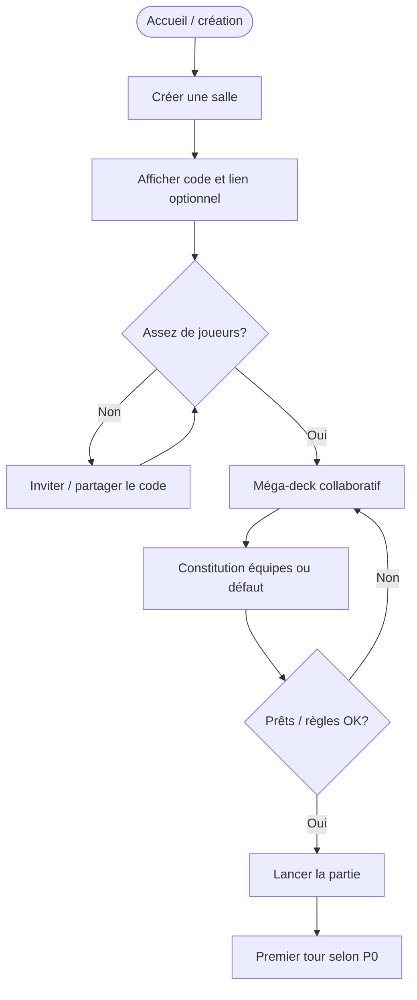
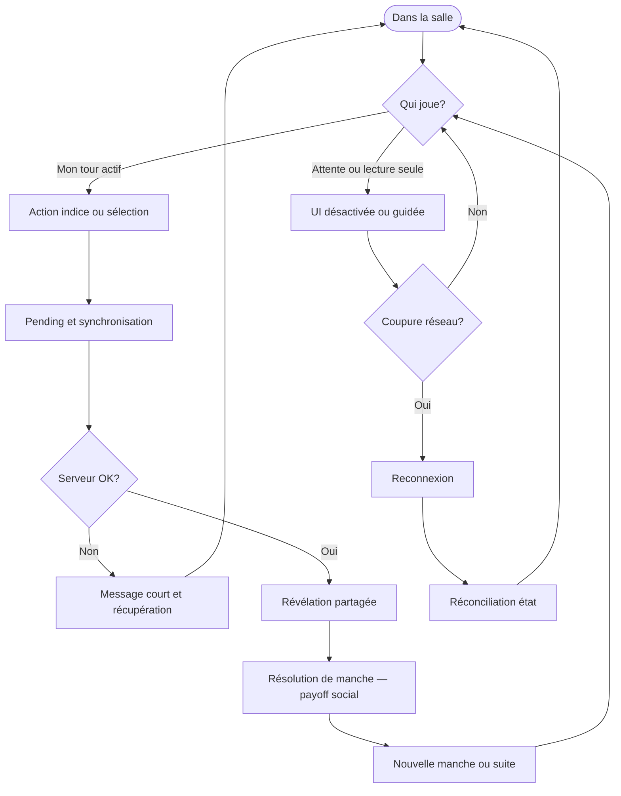
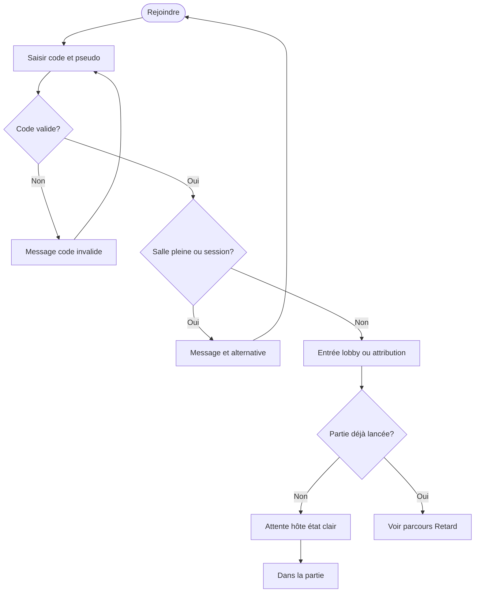
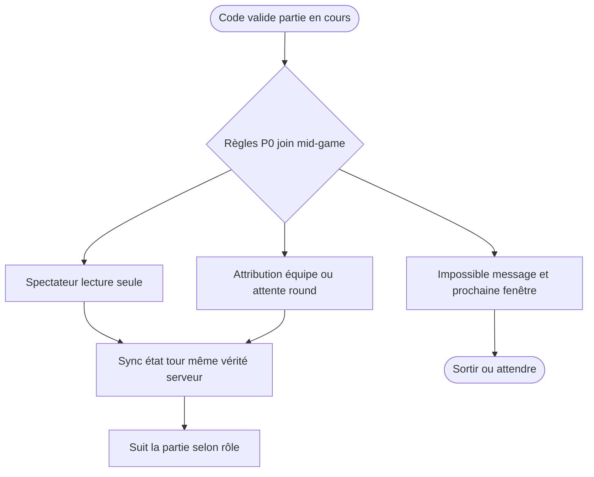
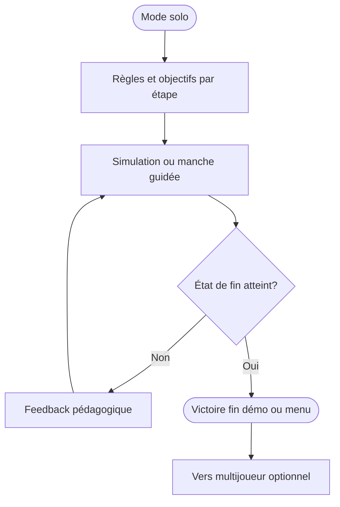
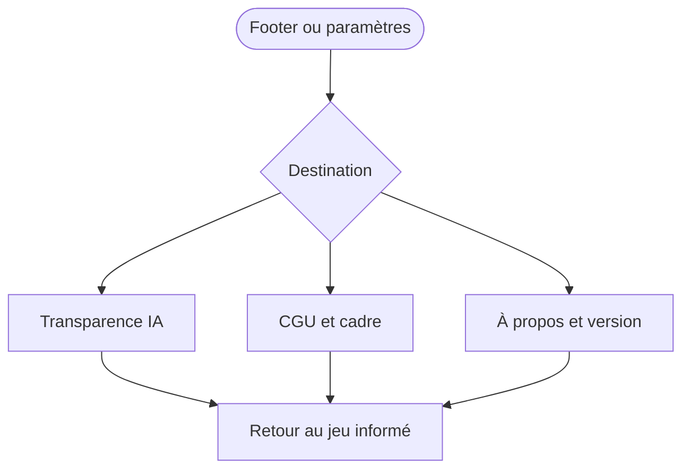

---
stepsCompleted:
  - 1
  - 2
  - 3
  - 4
  - 5
  - 6
  - 7
  - 8
  - 9
  - 10
  - 11
  - 12
  - 13
  - 14
lastStep: 14
inputDocuments:
  - _bmad-output/planning-artifacts/prd.md
  - docs/project-context.md
  - _bmad-output/planning-artifacts/architecture.md
workflowType: ux-design
project_name: Mousquetaire
user_name: Acuzou
date: '2026-05-02'
document_output_language: French
---

# UX Design Specification — Mousquetaire

**Auteur :** Acuzou  
**Date :** 2 mai 2026  

---

## Résumé exécutif

### Vision du projet

**Mousquetaire** est une application web multijoueur centrée sur une **salle de jeu** en quasi temps réel : indices, sélections et révélations sur une grille de mots, dans un cadre **18+**, **entre proches**, avec un ton **léger et drôle** porté par la copy système (toasts, erreurs, paramètres). La promesse n’est pas un tableau de scores froid mais une **soirée** où la **phrase d’un humain** reste le payoff. La V1 est **sans compte persistant** (code + pseudo), **100 % français**, avec une **variante Mousquetaire P0 figée** pour tenir la deadline ; l’**IA** est **utile mais optionnelle** et **ne bloque pas** le multijoueur nominal. La spec UX **n’engage pas** implicitement chat complet, matrice infinie d’appareils, PWA, WCAG maximale ni suite IA exhaustive — **honnêteté de version** et périmètre alignés PRD.

### Utilisateurs cibles

- **Hôte / animatrice de soirée (ex. Éléna)** : créer une salle vite, clarifier les rôles avant le premier indice, éviter l’exclusion pendant la préparation (méga-deck collaboratif).
- **Joueurs sous contrainte réseau (Thomas / Alex)** : **stabilité perçue**, **indicateur de tour** clair, **transparence** (version, CGU, usage IA) sans jargon.
- **Invité** : parcours **code + pseudo** avec erreurs **courtes et actionnables** ; si partie déjà lancée, statut **spectateur / attente / équipe** **lisible** sans humiliation produit.
- **Joueur solo pédagogique** : progression **sans pression sociale**, feedback pédagogique, parcours **complétable** jusqu’à une fin d’état nominal.
- **Premiers joueurs du format** : la V1 doit anticiper une **charge cognitive** (règles, vocabulaire, timers) — encart, solo intro ou rappels courts **sans** tutoriel interminable.

### Défis de conception majeurs

1. **Synchronisation ressentie** : aligner le multijoueur temps réel avec une UX « party » (pas de blocage multi-secondes sur le parcours nominal ; reveals cohérents pour tous).
2. **États réseau, erreur et déconnexion** : au-delà du libellé générique « réseau », prévoir **reconnexion**, **pause / gel**, **hôte absent** — messages qui **réduisent la culpabilité** et **préservent le groupe** ; alignement FR28–29 une fois le comportement produit tranché.
3. **Frontière intention locale / vérité serveur** : éviter l’**optimisme trompeur** ; états **en cours** / **synchronisé**, indicateurs de **fraîcheur**, toasts si le serveur **écrase** une vue locale ou si la **réconciliation** échoue ; chemin de récupération **clair**.
4. **Layouts adaptatifs** : grille, liste de mots, zones pré-partie ; **tactile ≥ 44 px** ; **orientation** à décider explicitement ; matrice navigateurs **bornée** avec message « environnement non supporté » acceptable.
5. **Cas limites sociaux** : mauvais code, salle pleine, **rejoin mid-game**, **départ / déconnexion de l’hôte** — pas d’écrans muets ni d’ambiguïté sur « qui peut quoi ».
6. **Accessibilité proportionnée** : rejoindre une salle, action principale du joueur actif, erreurs réseau, accès CGU / transparence — **clavier**, **focus**, **`prefers-reduced-motion`** pour le non essentiel.

### Opportunités de conception

1. **Humour système structuré** : catalogue de messages et toasts cohérents pour une **personnalité** forte tout en gardant des **erreurs critiques** limpides ; **signal léger** que le ton est décalé et que le cadre reste **entre amis / 18+**, pour éviter friction sociale non consentie.
2. **Moments de climax UX** : révélations et fins de manche comme **pics visuels et temporels** — renforcer le « playfeel » visé par le PRD.
3. **Confiance sans fausse promesse de modération** : UX honnête sur **UGC non filtré** et **18+** ; pages courtes, pas de dark patterns — aligné parcours « Transparence, confiance et données » du PRD.

### Complément — Party Mode (compréhension projet, 2026-05-02)

Synthèse des échanges (Sally — UX, Winston — architecture, John — produit / périmètre) intégrée au résumé ci-dessus ; points additionnels **tracés** pour les stories et l’implémentation :

- **Périmètre honnête V1** : pas d’engagement implicite sur **chat** riche (growth), **qualification universelle** des contextes salon, **PWA**, **i18n**, **WCAG AAA**, ou **suite IA complète** comme condition du ship ; résolution **hôte absent** **sans** décision produit écrite = hors promesse UX implicite.
- **Charge cognitive « première fois »** : mini-chemin **règles / vocabulaire** (solo ou encarts) si la table accueille des joueurs qui ne maîtrisent pas encore le format.

## Expérience utilisateur centrale

### Définir l’expérience

Le **cœur** de Mousquetaire est la **boucle de jeu synchrone** dans une **salle partagée** : **indice → sélection(s) sur la grille → révélation**, jusqu’à une **fin de manche** comprise par toute la table. L’interaction **non négociable** à réussir est que **chaque joueur sache à tout moment qui doit agir** et que son **action principale au tour** (indice ou sélection) produise un **retour immédiat cohérent** avec l’**état authoritative** serveur après synchro. La valeur « party » tient quand cette boucle est **ressentie comme fluide** malgré le réseau ; l’architecture impose une **réconciliation** avec le serveur que l’UI doit **rendre honnête** (pas d’optimisme trompeur sur les actions irréversibles).

**Préparation** (méga-deck, équipes, lancement) et **spectateur / rejoin mid-game** sont des **surfaces UX importantes** mais **distinctes** du « moment critique » qui prouve le ship : elles suivent des critères **P0 minimal** ou **phase confort** selon arbitrage explicite — sans diluer la définition du cœur.

### Stratégie plateforme

- **Web**, application **SPA** pour la room et la grille ; pages **CGU**, **transparence IA**, **À propos** peuvent être plus **documentaires**.
- **Navigateurs** : priorité **Chrome / Edge** (desktop et Android récents) pour le parcours P0 ; **Firefox** et **Safari** (desktop et iOS) en **cible de tests pré-ship** ; message **environnement non supporté** acceptable hors matrice V1.
- **Modes d’interaction** : **souris/clavier** et **tactile** ; **zones cliquables ≥ 44 px** ; ordre de tabulation et **focus visible** sur les parcours critiques (rejoindre, action de tour, erreurs, liens légaux).
- **Offline / jeu synchrone** : **pas** d’objectif hors-ligne pour la partie en cours en V1 ; déconnexion gérée par **états et messages** explicites.

### Interactions sans friction

- **Entrer dans la salle** : code + pseudo, erreurs **courtes et corrigeables** (code invalide, salle indisponible).
- **Comprendre le tour** : **indicateur de rôle / joueur actif** permanent sans surcharge cognitive.
- **Agir au bon moment** : validation ou refus **lisible** ; pas de « clic dans le vide » après lag.
- **Revenir après coupure** : retrouver **l’état du tour** et son **mode** (lecture seule vs action) **sans** corrompre la partie pour les autres.

### Moments critiques de réussite

- **Révélation synchrone** : tous voient la même carte / résultat au même moment — preuve que le **temps réel** tient la route.
- **Premier cycle complet** multijoueur (création → préparation minimale → premier indice → sélections → révélation) comme **preuve de ship** utilisateur.
- **Fin de manche** : résultat **lisible** et **partageable émotionnellement** (pas seulement technique).

### Principes d’expérience

1. **Tour lisible avant action** — toujours savoir **qui** doit faire **quoi**.
2. **Feedback immédiat sur l’intention** — succès, refus ou état du jeu (FR31).
3. **Honnêteté réseau / serveur** — états **en attente**, **rejet**, **réconciliation** ; pas de silence frustrant.
4. **Précarité perçue** — distinguer ce qui est **provisoire** (pending) de ce qui est **confirmé par le serveur** (resolved) ; transitions **compréhensibles** si le serveur **réécrit** l’état affiché ; éviter les rollbacks **brutaux** sans micro-feedback (aligné architecture WebSocket / réconciliation).
5. **Soirée d’abord** — réduire étapes et jargon dans la boucle ; réserver la complexité aux **écrans secondaires** (options, légal, IA).
6. **MVP ship mesurable** — **une mission utilisateur claire** pour la date (boucle jouable bout en bout) ; tout ajout **confort** (solo étendu, polish préparation) **remplace** à périmètre égal ou est reporté — éviter l’infilation du « cœur » documentaire.

### Complément — Party Mode (expérience centrale, 2026-05-02)

- **Winston — précarité perçue :** grammaire **pending / resolved** et feedback lorsque l’autorité serveur **corrige** la vue locale.
- **Sally — cœur vs enveloppes :** la boucle **tour** reste le critère de vérité du ship ; **préparation** et **spectateur** explicitement **tier 2** ou **P0 minimal** selon liste d’arbitrage.
- **John — découpe deadline :** figer la **mission mesurable** pour le **10 mai** ; pas de fusion solo / préparation / polish dans le même engagement « ship » sans substitution.

## Réponses émotionnelles souhaitées

### Objectifs émotionnels primaires

1. **Appartenance à la table** — « on est dans la même partie », y compris en préparation et après un raté technique mineur.
2. **Plaisir et légèreté** — ton **drôle** système qui **souligne** le fun sans **voler** la vedette aux phrases des joueurs.
3. **Confiance lucide** — transparence **18+**, **pas de filtre** sur les mots, usage **IA** expliqué : le joueur se sent **informé**, pas **piégé**.
4. **Suspense ludique** — au tour, une tension **bon enfant** (indices, révélations), pas une anxiété **outil cassé**.
5. **Complicité transgressive consentie** — cadre où l’humour noir reste **rituel d’appartenance** entre adultes qui **choisissent** le cadre ; éviter la cible **humiliation** d’une personne réelle à la table ; après une punchline limite, préserver la **chaleur** du groupe (aligné Party Mode — éviter « est-ce contre moi ? »).

**Émotion pivot V1 (critère de ship)** — à traiter comme **priorité mesurable** au-delà des autres objectifs émotionnels : **synchronie ressentie + rire ou tension partagée au moment de la révélation synchrone** (tout le monde voit la même vérité au même battement). Les autres dimensions affectives (animations élaborées, scoring « feel-good », tutoriels narratifs riches) restent **secondaires** sous contrainte **10 mai** sauf **substitution** de périmètre explicite.

### Cartographie du parcours émotionnel

| Phase | État émotionnel visé |
|--------|----------------------|
| **Découverte / entrée** | Curiosité, **pas** de friction honte (erreur de code = message neutre et corrigeable). |
| **Préparation (méga-deck)** | Co-construction, **inclusion** (« personne sur le banc » sans tutoriel interminable). |
| **Montée (avant reveal)** | **Suspense ludique** ; petites appréhensions comiques (« qui va me piéger ? »), contrôle perçu sur son rôle au tour. |
| **Cœur de partie** | Concentration **partagée**, **pic** à la **révélation synchrone** — rire / surprise **collectifs** parce que la vérité arrive **pour tous au même moment**. |
| **Après révélation / fin de micro-cycle** | **Soulagement drôle**, **rivalité renouvelée** ; mémoire du gag partagé ; envie de **revanche** — corde tendue vers la manche suivante **sans** dépendre d’une feature additionnelle obligatoire. |
| **Après erreur réseau ou synchro** | **Pas de culpabilité** utilisateur ; récupération **claire** (reconnexion, état du tour). |
| **Fin de manche / partie** | **Clôture satisfaisante** — envie de **relancer** (aligné porte playfeel PRD). |
| **Pages confiance (CGU, IA, À propos)** | **Sérieux sans morale lourde** ; lecture **possible** sur mobile sans fatigue. |

### Micro-émotions critiques

| Paire | Priorité Mousquetaire |
|--------|----------------------|
| **Confiance / confusion** | **Confiance** sur « qui joue » et « ce qui s’est passé » après une synchro serveur. |
| **Connexion / isolement** | **Connexion** au groupe ; l’isolement technique (déco) doit être **temporaire et nommé**. |
| **Excitation / anxiété** | **Excitation** sur les tours ; **anxiété** uniquement **ludique**, pas **panique produit**. |
| **Accomplissement / frustration** | **Accomplissement** en fin de manche ; **frustration** acceptable **courte** si suivie d’un **feedback** récupérable. |

### Implications design

| Émotion visée | Choix UX |
|----------------|----------|
| **Appartenance** | Liste des joueurs / équipes lisible ; statuts **spectateur / attente** sans infantiliser. |
| **Plaisir** | Copy système **humoristique** mais **jamais** au détriment d’un joueur isolé en erreur ; pas d’humour **ambigu** « contre » quelqu’un à la table — viser **système / absurde / soi-caricaturé** plutôt qu’une personne réelle. |
| **Confiance lucide** | Pages courtes ; **pas** de dark patterns ; transparence **IA** et **risques UGC** accessibles en un ou deux taps depuis le jeu. |
| **Suspense et climax** | Révélations **mises en avant** ; indicateur de tour **calme** et **autoritaire** ; transition **lisible** entre tension pré-reveal et **respiration** post-reveal. |
| **Dignité en échec technique** | Messages **réseau / synchro** qui expliquent **sans jargon** ; états **pending** compréhensibles (lien avec expérience centrale). |

### Principes de design émotionnel

1. **Le rire vient d’abord de la table** — l’UI **cadre** et **amplify** le social, elle ne **remplace** pas le payoff humain.
2. **Honte non technique** — erreurs utilisateur **réparables** sans ton moralisateur ; erreurs système **sans culpabiliser** le joueur.
3. **Transparence = respect** — cadre **18+** et **UGC** assumés avec **clarté**, pas avec **anxiété** administrative.
4. **Émotions synchrones** — révélations et fins de manche **partagées** ; éviter le décalage d’état ressenti comme « spoiler » entre joueurs.
5. **Une émotion pivot pour la date** — prioriser les signaux UX qui servent la **révélation synchrone partagée** avant les polishs affectifs génériques (animations, scoring émotionnel, etc.).

### Complément — Party Mode (réponses émotionnelles, 2026-05-02)

- **Sally — complicité consentie :** UX/copy qui réduisent le **malaise social** (« pour ou contre moi ») dans un cadre 18+ humour noir **entre amis**.
- **John — scope émotionnel :** éviter la dilution en « tout-en-un affectif » ; **émotion pivot** + critères mesurables avant polishs transverses (audio, animations, tutoriels narratifs).
- **Sophia — arc de manche :** entrée curiosité / tension ludique → **climax révélation synchrone** → soulagement / rivalité / **envie de suite** ; designer les **pauses** entre manches comme respiration narrative **légère**.

## Analyse de patterns UX et inspiration

### Analyse de produits sources (hypothèses de référence)

*Les références ci-dessous sont des **analogies de catégorie** pour extraire des patterns — à affiner avec 2–3 applications réellement utilisées par la cible.*

| Référence (type) | Ce qui fonctionne pour l’UX | Transposition Mousquetaire |
|------------------|-----------------------------|----------------------------|
| **Jeux « salon » type packs party** | Code de salle court, entrée rapide, ton léger, tout le monde voit le même « spectacle » au même moment | **Code room + pseudo** sans compte ; **révélation synchrone** comme moment partagé ; ton **drôle** sans lourdeur onboarding |
| **Assistants de partie / plateau numérique** | Qui joue, phase de tour claire, peu de menus pendant la manche | **Indicateur de tour** omniprésent ; **HUD** minimal en jeu ; options dans des couches secondaires |
| **Messagerie / invitation rapide** | Friction basse pour « rejoindre », erreurs sans humiliation | **Rejoindre par code** avec messages **neutres** si échec ; pas de culpabilité utilisateur |
| **Présence type salon vocal léger** | Sentiment d’être dans le même canal, états « qui est là » | Liste des joueurs / équipes **lisible** ; statut **spectateur / attente** explicite |

**Jeux du même genre social** (grille + équipes + indices, *sans* reprendre nom ni asset marqués) : leçon UX souvent **lisibilité de la grille**, **feedback carte**, **pause** avant reveal — à adapter à la **variante Mousquetaire P0**.

### Patterns UX transférables

**Navigation & hiérarchie**

- **Shell unique « salle »** pendant la partie (SPA) — pas de rechargement dans la manche.
- **Actions légales / confiance** (CGU, IA, À propos) en **couche secondaire** (footer, menu …), jamais au milieu du tour.

**Interactions**

- **Room code + liste joueurs** en tête de l’expérience sociale.
- **États de tour** : actif / attente / lecture seule — **codage visuel** stable (couleur + texte court).
- **Révélation** : **beat** visuel commun (flip, highlight, son optionnel **si** marge) — le pattern est la **synchronicité perçue**, pas l’effet gratuit.

**Saisie de texte sous pression (mobile / web)**

- **Clavier logiciel** : validation d’**indice** ou texte — anticiper **autocorrect**, **accents**, **double tap** ; état **brouillon / figé** avant envoi serveur.
- **Justice perçue sous latence** : ordre de traitement **compréhensible** si plusieurs actions concurrentes ; éviter le sentiment « le réseau a choisi mon camp » sans explication.

**Visuel & émotion**

- **Contraste suffisant** pour lire cartes et rôles en soirée (lumière variable).
- **Animations non essentielles** pliables sous **`prefers-reduced-motion`** (NFR / PRD).

### Anti-patterns à éviter

- **Indicateur de tour ambigu** ou noyé — frustration « clic dans le vide » (contraire FR13 / expérience centrale).
- **Optimisme UI sans résolution** — enthousiasme local puis **effacement brutal** par le serveur sans explication (contraire **précarité perçue**).
- **Onboarding long** avant la première action utile — incompatible avec **≤ ~3 min** vers « prêt à jouer » (PRD).
- **Esthétique esport / leaderboard froid** si elle **refroidit** la promesse « soirée entre amis ».
- **Modération implicite** par le ton de l’UI — incompatible avec la promesse **pas de filtre** ; rester **clair** sur les risques sans infantiliser.
- **Révélation synchrone mal nommée** — états flous **avant / pendant / après** reveal qui forcent des rustines serveur (buffers, replays) évitables par le parcours utilisateur.

### Stratégie d’inspiration

**Adopter**

- **Code salle + pseudo immédiat** — friction basse (FR1–2).
- **Indicateur de tour omniprésent** — cœur de l’expérience.
- **Révélation comme pic synchrone** — sert l’**émotion pivot** et le playfeel.
- **Erreurs récupérables et neutres** — dignité utilisateur ; réseau explicité.

**Adapter**

- Patterns **party console / TV** → **web mobile + desktop** ; zones tactiles **44 px** ; pas de dépendance à une télécommande physique.
- **Humour type packs party** → **français**, **ton Mousquetaire**, sans copier un catalogue de jeux existant.

**Éviter**

- **Complexité lobby** avant boucle jouable — risque **deadline**.
- **Features « surprise / delight »** avant **boucle fiable** — dilution d’effort.
- **Dark patterns** sur données / IA — contredit **confiance lucide**.
- **Parité de fonctionnalités** avec les références (Jackbox, Discord, etc.) — risque **scope creep** ; n’emprunter que des **primitives** (voir complément Party).

### Complément — Party Mode (inspiration & patterns, 2026-05-02)

- **Sally — friction cognitive sur les mots :** traiter explicitement **micro-UX** de saisie (clavier, autocorrect, majuscules / accents, soumission figée vs brouillon), **équité perçue** sous latence, **retour après interruption** sans perdre le fil du round ; patterns proches **formulaires critiques** / **quiz** sous temps.
- **Winston — reveal synchrone :** figer en conception les états **pré-reveal / reveal / post-reveal** alignés sur les événements temps réel ; réduit le risque de correctifs serveur lourds si l’UX **nomme** mal les transitions.
- **John — inspiration sans scope creep :** chaque référence se traduit en **primitive UI** (un écran, un état, une règle de copy) ; pas de **feature parity** avec les produits cités.

## Fondement du système de design

### Choix du système de design

**Approche retenue :** système **thémable** basé sur **Tailwind CSS** + composants **headless** (**Radix UI**) et, si adopté dans le repo, pattern **shadcn/ui** (composants copiables, mêmes fondations). Alternatives mentionnées pour arbitrage ultérieur : **Chakra UI** ou **MUI** avec thème fortement personnalisé ; **Panda CSS / Vanilla Extract** (plus strict, courbe plus raide) ; **Headless UI + CSS modules** (plus de travail accessibilité maison).

### Justification du choix

- **Contrainte calendaire** : livrer la **boucle de jeu** et les **états temps réel** plutôt qu’une bibliothèque graphique entièrement maison.
- **Accessibilité proportionnée** : primitives éprouvées pour focus, clavier, dialogues — aligné NFR-A.
- **Personnalisation** : identité **Mousquetaire** via **tokens** et **thème**, sans dépendre du rendu **Material** par défaut si une direction **soirée / chaleureuse** est prioritaire.
- **Cohérence avec l’architecture** : **React + Vite + TypeScript** ; pas de verrou hors stack sans besoin explicite.
- **Risques à piloter (bundle / maintenance)** : limiter les imports massifs shadcn ; **tree-shaking** ; surveiller **versions Radix** et évolutions **Tailwind** (ex. v3 vs v4) ; documenter les **conventions** (`cn()`, variants) pour réduire le **lock-in cognitif** futur.

### Approche de mise en œuvre

1. Configurer **Tailwind** et les **tokens** (couleurs, rayons, espacements, typographie).
2. Introduire les primitives nécessaires (**boutons**, **modales**, **toasts**, **listes**, **navigation**) via **Radix** ou **shadcn**.
3. Encapsuler les **patterns métier** (carte du jeu, indicateur de tour, bande joueurs) dans des composants **feature** qui **consomment** les primitives — aligné `features/` + `components/ui` dans l’architecture.
4. **Discipline composants** : conventions **`cva` / variants**, pas de duplication de classes sans tokens ; revue **accessibilité** lors des overrides Radix (composition correcte des primitives).

### Stratégie de personnalisation

- **Tokens sémantiques** (`primary`, `destructive`, `muted`, `card`, `turn-active`, …) — éviter le **gris neutre « corporate »** par défaut si l’identité doit rester **conviviale** ; trancher **palette** et **contraste** tôt pour **grille** et **soirée** (lumière variable).
- **Copy et toasts** : un **seul système de notification** ; messages **catalogués** en français (aligné architecture).
- **Motion** : animations **courtes** sur révélation ; respect **`prefers-reduced-motion`**.
- **Revues pré-ship** : contraste et tailles tactiles sur **Chrome mobile** + **Safari iOS** (matrice PRD).

### Complément — Party Mode (système de design, 2026-05-02)

- **Winston :** risques **bundle** et **lock-in de conventions** ; alternatives **Panda/VE**, **MUI/Chakra**, **Headless UI** pour trace de décision ; standardiser tôt les **primitives** et documenter.
- **Sally :** identité **party** portée par **tokens** et contraste **cartes / soirée**, pas par le choix React seul.
- **Amelia :** éviter l’empilement de composants **sans tokens** ; aligner versions **shadcn/Radix** ; **DS minimal** stable avant micro-optimisations ; composition **a11y** non négociable sur overrides.

## 2. Interaction centrale et mécanique (expérience signature)

### 2.1 Expérience déterminante

**Formulation courte :** « **À chaque tour, on sait qui est le donneur d’indices et qui devine** ; on enchaîne **indice → choix sur la grille → tout le monde voit la révélation au même instant** ; et **je sais toujours si c’est à moi d’agir ou d’attendre.** »

- **Donneur d’indices** et **devineur** (libellés exacts alignés sur la **variante P0** et les règles retenues) ancrent le **fantasy de rôle** : risque de l’indice *vs* transformation de l’ambiguïté en mots sur la grille — mémorisable **sans** tutoriel long.
- **Révélation synchrone** reste le **hook sensoriel** (tension, timing, spectacle partagé) ; les **rôles nommés** évitent un pitch abstrait.

C’est l’interaction que les joueurs peuvent **raconter** après la soirée. Si **une seule chose** doit être parfaite pour la V1, c’est cette boucle **multiclient cohérente** + **indicateur de tour imparable**.

### 2.2 Modèle mental utilisateur

- **Référence culturelle** : jeux de type **mots en équipes sur grille** / soirée plateau — attente d’**équipes**, **tour qui passe**, **cartes qui se retournent**.
- **Web** : comparaison à **apps à code** et **jeux navigateur** — mental modèle = **« je suis dans une room avec les autres »**, pas un tableau de bord administratif.
- **Pièges** : confondre **code de salle** (entrée) et **cœur produit** ; négliger **latence** et file d’intentions ; oublier **spectateur / rejoin** — le modèle doit rester **lisible** (« je regarde » *vs* « je joue »).

### 2.3 Critères de succès de l’interaction centrale

| Indicateur | Détail |
|------------|--------|
| **Cohérence** | Deux clients : **même état** après indice, sélection et révélation (Technical Success PRD). |
| **Clarté du tour** | En peu d’attention, le joueur sait **s’il doit agir** et **quelle action** (indice *vs* sélection). |
| **Révélation synchrone** | Tous voient le **même résultat** au même **beat** — pic émotionnel et technique. |
| **Erreur récupérable** | Réseau / rejet : message **court** ; pas de corruption du tour pour les autres ; **pending / resolved** compréhensibles. |
| **« Ça marche »** | Partie racontable **sans** expliquer le bug (playtest PRD). |

### 2.4 Patterns établis vs innovation

- **Établis** : **grille de cartes**, **code de salle**, **liste joueurs / équipes**, **action primaire** par tour.
- **Combinaison** : **méga-deck collaboratif** + **variante Mousquetaire P0** — patterns **connus** (listes, champs) avec **limites** V1 visibles pour limiter la charge cognitive.
- **Innovation maîtrisée** : **réconciliation serveur + optimisme UI** — pas de nouveau geste ; **états** et **micro-copy** portent l’apprentissage (précarité perçue).

### 2.5 Mécanique de l’expérience (boucle tour)

**1. Initiation** — Partie **jouable** ; le joueur actif voit l’invite **indice** ou **sélection** ; les autres **attente** / **spectateur** selon règles P0.

**2. Interaction** — **Indice** : saisie texte (mobile : clavier, validation, limites P0) → **pending** jusqu’à **acceptation serveur**. **Sélection** : tap / clic ; feedback local puis **confirmation** ou **correction** serveur ; **anti double-submit** clair.

**3. Feedback** — **Succès** : mise à jour partagée ; animations courtes. **Erreur** : message **français** ; pas de reset brutal sans explication. **Réconciliation** : transition **lisible** si le serveur **corrige** l’état (pas de disparition instantanée).

**4. Achèvement du sous-cycle** — **Révélation** : états UI **pré-reveal → reveal → post-reveal** alignés sur les **événements temps réel** (voir lien UX ↔ contrat ci-dessous). **Indicateur de tour** mis à jour pour la suite.

**5. Suite** — Prochain tour ou **fin de manche** ; possibilité de **relancer** sans quitter l’appartenance au groupe.

### 2.6 Cas limites obligatoires (hors happy path)

À trancher en **conception** et en **règles** pour éviter **révélations fantômes**, **faux clics** ou **decks figés** :

- **Spectateur / joueur hors tour** : **interactions permises** ou **désactivées** par phase ; pas d’invitation ambiguë à cliquer sur la grille.
- **Fin prématurée** (abandon, timeout, victoire avant fin de séquence) : qui **possède** l’état **pending** ; ce qui est **annulé** *vs* **résolu** ; cohérence pour les clients restants.
- **Undo, reverse, gage** (si dans le périmètre P0) : pendant **pending**, comportement explicite — annulation de sélection, **révélation partielle** ou retour à un **état stable** ; alignement avec **méga-deck** (cartes déjà vues, intentions commitées).

### 2.7 Lien UX ↔ contrat d’événements

Les écrans et transitions ci-dessus doivent rester **alignés** avec le **catalogue d’événements** / **OpenAPI** (cf. `architecture.md`) : pour chaque **intention utilisateur** critique, une **trace** **UX → type d’événement / commande → effet serveur** est maintenue dans les **stories** d’implémentation (idempotence, ordre acceptable des messages, reprise après coupure). Cette spec UX ne remplace pas le **contrat** ; elle **impose** des invariants visibles côté joueur (**at-most-once** perçu, **résolution** des conflits) cohérents avec la **réconciliation** documentée côté architecture.

### Complément — Party Mode (interaction centrale, 2026-05-02)

- **Sally :** **Spectateur**, **fin prématurée**, **undo / reverse / gage** en **pending** — points de conception **obligatoires** pour une table **complète**, pas seulement un happy path.
- **Winston :** **Tableau de traçabilité** (stories) **UX → message / événement → garantie serveur** ; idempotence et **invariants** communs.
- **Samus :** **Donneur d’indices** et **devineur** nommés dans l’accroche **expérience déterminante** — fantasy de rôle **mémorable**.

## Fondations visuelles du design

### Système de couleurs

**Direction** : ambiance **soirée / conviviale**, lisible en **lumière tamisée** — éviter le **gris froid « dashboard »** par défaut.

**Sémantique (tokens à figer dans Tailwind / CSS)** :

| Token | Rôle |
|--------|------|
| `background` | Fond général — ton **chaud** ou **neutre doux**. |
| `card` / `muted` | Surface des **cartes mot** et zones secondaires — **contraste** suffisant avec le texte. |
| `primary` | Actions principales (**Envoyer l’indice**, **Valider**, rejoindre). |
| `destructive` | Mots noirs / erreurs critiques — **distinct** sans panic visuelle. |
| `turn-active` / `accent` | **Tour en cours** — joueur ou équipe active (**distinct** du primaire si besoin). |
| `team-*` (optionnel P0) | Couleurs d’**équipe** si variante requise — **ne pas** n’expliquer l’état **que** par la couleur (texte ou icône en renfort). |
| `warning` / `legal` | États **sensibles** (avertissement 18+, cadre légal) — **sobriété** lisible sans casser le ton ludique (complément Party). |

**Contraste** : texte courant et libellés de cartes conformes aux objectifs **lisibilité** WCAG (NFR-A / PRD) ; revérifier si **mode sombre** ajouté plus tard (**hors V1** sauf décision explicite).

### Typographie

- **Ton** : **moderne**, **accessible** ; la personnalité vient surtout de la **copy**.
- **Paires possibles** : **Inter**, **Source Sans 3**, ou pile **system-ui** pour performance et **français** (accents).
- **Échelle** : titre de salle, indice affiché, libellés carte, micro-copy erreur ; tailles **minimum** confortables sur **mobile**.
- **Gras** : réservé aux **états** (tour actif, alerte).

### Espacement et mise en page

- **Unité de base** : **4 px** ou **8 px** (aligné Tailwind).
- **Grille de jeu** : **gouttières** pour **touches** et limiter **misclics** (≥ **44 px** zone minimale PRD).
- **Layout** : **colonne** privilégiée sur **mobile** ; zones **empilées** pour la V1.
- **Respiration** : hiérarchie **indice / grille / tour** lisible en un coup d’œil.

### Accessibilité visuelle

- **Contraste** texte / fond sur **cartes** et **boutons** ; tests **Chrome + Safari iOS** pré-ship.
- **Focus visible** (parcours clavier critiques).
- **`prefers-reduced-motion`** : révélation **lisible** sans dépendre uniquement du mouvement.
- **Couleur seule** : **icône** ou **libellé** en renfort pour équipes / danger.

### Discipline tokens (implémentation)

- Déclarer les couleurs dans **`tailwind.config`** sous forme **sémantique** ; les **primitives** React **consomment** uniquement ces tokens — pas de **`bg-blue-500`** ni hex **hors DS** dans les features (exception documentée en revue).
- **Source unique** pour éviter palette UX « fiction » et dérives **clair/sombre** si V2 (complément Party — Winston).

### Périmètre visuel V1 (produit)

- **Un** thème **clair** pour le ship sauf **décision produit** explicite d’un **dark mode** (qui **double** la surface token + QA).
- Pas de **multi-thèmes joueur** ni **illustration narrative** complète **sans** ligne PRD — éviter dérive scope (complément Party — John).

### Complément — Party Mode (fondations visuelles, 2026-05-02)

- **Sally :** **Signature émotionnelle** légère (micro-animations sobres) ; tokens pour **états sensibles** (18+, légal) ; éviter illustrations **datées** en V1 si pas de capacité production.
- **Winston :** tokens dans **`tailwind.config`** + primitives ; interdire couleurs brutes hors DS.
- **John :** **un** thème principal V1 ; dark / multi-thème / illustration pipeline = **hors scope** sauf arbitrage explicite.

## Design Direction Decision

### Design Directions Explored

Huit directions mockées dans `_bmad-output/planning-artifacts/ux-design-directions.html` : **A** Salon chaleureux ; **B** Cartes contrastées ; **C** Dense tactique ; **D** Aéré minimal ; **E** Équipes teintées ; **F** Soirée tamisée ; **G** Mobile-first empilé ; **H** Split desktop — couvrant densité, hiérarchie, ambiance claire vs tamisée, teintage équipes, et gabarits mobile vs bureau.

### Chosen Direction

**Hybride retenu pour la V1 :** **A (Salon chaleureux)** comme base émotionnelle et chromatique (convivialité, « soirée »), avec **renfort type B** sur les zones critiques — **indice**, **cartes mot**, **états de tour et erreurs** — pour garantir hiérarchie et lisibilité (dont accessibilité). **G** et **H** sont traités comme **adaptations de mise en page** d’une même direction (colonne mobile / élargissement bureau), pas comme deux produits distincts.

**E (teintes équipe)** : **accents** uniquement (bordure, halo léger, badge), pas teintage global des neutres — avec libellé ou icône en renfort (**pas** la couleur seule).

**Report ou usage limité par défaut :** **F** comme second thème complet ; **C** comme densité par défaut sur la grille (charge cognitive). **D** exploitable comme épuration si typo et texture évitent l’effet « SaaS froid ».

### Design Rationale

Alignement **JTBD** (rejoindre vite, lire la grille à distance, ton 18+ convivial), **fondations visuelles** (étape 8) et **roundtable Party Mode** (2026-05-02) : convergence UX (**Sally**), produit (**John**), implémentation (**Winston**) et game-feel (**Samus**) vers **chaleur + contraste ciblé** et **une surface token / QA maîtrisée** pour un **thème clair unique** en V1.

### Implementation Approach

- **Tokens** : palette sémantique Tailwind (étape 8) ; états carte, indice, tour et légal documentés ; pas de jeu **clair + sombre** complet sans arbitrage produit explicite.
- **Équipes** : tokens d’accent **limités** ; neutres sur une échelle commune pour limiter la dérive visuelle.
- **Responsive** : une grille de vérité responsive ; éviter **deux expériences produit** mobile vs bureau sans budget QA — implémenter d’abord les patterns **G**, puis **H** si le backlog le porte.
- **Référence maquette** : fichier HTML des directions pour inspiration ; **source de vérité** = tokens et composants dans le dépôt.

### Complément — Party Mode (décision de direction, 2026-05-02)

- **Sally :** **A + touches B ou E** ; **G/H** comme cadrages d’une même scène ; risques **A seul** (contraste), **C**, **F**, **E**, **D** comme au roundtable.
- **John :** veto **dense par défaut**, **F seul** sans audit contraste, **palette équipe** qui multiplie les états sans justification ; garde-fou **deux UX produit** sans budget design double.
- **Winston :** minimiser branches thème ; **E** sur accents, pas neutres globaux ; **F** accepté seulement avec budget jetons + QA.
- **Samus :** lisibilité au moment **indice / révélation** ; éviter **densité** et **couleur équipe sur le corps des lettres** — préférer **bordure ou halo léger**.

## User Journey Flows

Les parcours ci-dessous prolongent la section **User Journeys** du PRD par des **mécaniques d’interaction**, des **branches d’erreur** et la distinction **promesse UX / arbitrage P0** — alignés sur la direction **A+B** (étape 9) et l’interaction centrale (étape 7).

### Promesses UX vs arbitrages P0 (TBD)

| Promesse UX (tenir le discours produit) | À trancher en P0 / technique (TBD — ne pas sur-promettre) |
|----------------------------------------|-----------------------------------------------------------|
| Hôte crée une partie → les autres rejoignent → **état synchrone lisible** avec **messages d’erreur explicites** et **récupération** sans quitter la salle quand le PRD le prévoit. | Granularité **source de vérité** serveur, **retry/backoff** précis, ordre des événements temps réel. |
| **Retard** : rejoindre avec **résumé d’état** ou **catch-up minimal** compréhensible. | **Rewind** temps réel **vs** résumé texte — effort d’implémentation. |
| **Solo** : parcours **complet** sans autres joueurs jusqu’à un **état de fin** prévu (cf. Success Criteria PRD). | **Passerelle solo → multi** ou session hybride : **hors MVP** sauf décision explicite. |
| **Transparence** : « ce que vous acceptez » + liens **CGU / IA / version** — pages courtes, pas de dark patterns. | **Audit légal**, export données, **versioning** poussé des politiques — **hors scope** tant que non clos juridiquement. |

**Critère playfeel (Samus) :** avant d’optimiser uniquement le stress réseau, valider que la boucle reste **vivante à table** (moments sociaux lisibles) — cf. **résolution de manche** ci-dessous.

### Traçabilité vers les critères de succès PRD

- **E2E multijoueur** et **fin de manche** : parcours **Éléna** + boucle **Thomas/Alex** ; indicateurs mesurables (première synchro, « prêt à jouer », abandon réseau) à relier aux **stories** en conception.
- **Solo complétable** : parcours **Solo pédagogique** relié explicitement au critère **User Success** PRD (état de fin sans blocage).
- **Losanges à nommer pour les stories** : **hôte absent** ; **salle expirée / code invalide / salle pleine** ; **reconnexion** (coupure **vs** départ volontaire **vs** exclusion) ; **late join** (spectateur / équipe / prochain round — selon règles P0).

### Matrice d’états synchrones / dégradés (honest sync)

Sur chaque nœud **pending** ou **erreur** : **message** + **CTA** (réessayer, relire le code, attendre, retour accueil) — **pas d’écran muet** ; emplacement des erreurs **réseau** documenté (bannière, toast, zone dédiée). **Itérateur de tour** : même information **visuelle + textuelle** ; prévoir **annonce** pour lecteurs d’écran (**aria-live** raisonnable sur changement de joueur actif et fin de tour).

### Éléna — De la création au « prêt à jouer »

**Objectif :** friction basse (ordre de grandeur **≤ ~3 min** vers premier tour possible), inclusion pendant le méga-deck, clarté des rôles avant le coup d’envoi.

**Points de conception :** code de salle visible et copiable ; états « en attente de joueurs » ; méga-deck collaboratif avec défauts P0 ; constitution d’équipes ou défaut explicite ; **Lancer** désactivé tant que les prérequis P0 ne sont pas remplis (retour court si action prématurée).

### Thomas et Alex — Boucle synchrone, fin de manche et résilience

**Objectif :** état autoritatif partagé après indice → sélection(s) → révélation ; **payoff social** avant la suite technique ; reprise après coupure sans bloquer les autres.

La **révélation** reste le pic immédiat ; la **résolution de manche** (récap, score ou message de fin de round — selon P0) est un **beat distinct** du simple **comptage** ou de la **progression** non essentielle.

### Invité — Code, validation et reprise

**Micro-copy canonique :** code invalide, salle pleine, pseudo refusé, salle fermée — ton **rassurant**, sans jargon technique.

### Retard — Rejoindre une partie en cours

Si le produit limite au **spectateur** jusqu’à la prochaine manche, le libellé doit l’indiquer clairement — pas de promesse implicite d’être **tout de suite** dans l’équipe active.

### Solo pédagogique — Apprendre sans pression sociale

**Alignement game-feel :** même **rituel de révélation / tension** qu’en multijoueur dans la mesure du possible (timing, attente, clarté du payoff), pas uniquement une mécanique abstraite.

Prévoir un message si **double contexte** (solo vs room ouverte) pour éviter la désorientation.

### Transparence, confiance et données

Liens **focusables**, titres de page clairs ; si l’**IA** intervient tôt dans le parcours, une **mention courte** avant le premier engagement peut être requise — à arbitrer avec le PRD.

### Journey Patterns

- **Navigation :** hub **Accueil** → **Salle** ou **Solo** ; légal depuis **footer** sans piège de focus (NFR accessibilité PRD).
- **Décision :** branches **succès** / **erreur récupérable** / **réconciliation** sur les intentions critiques ; pas d’optimisme trompeur sur les actions irréversibles.
- **Feedback :** **indicateur de tour** omniprésent en jeu ; **pending** visible pour le joueur actif ; **toasts ou bannières courts** pour réseau.

### Flow Optimization Principles

- **Pas vers la valeur :** **code + pseudo** ; création salle avec **défauts P0** ; méga-deck **borné** (PRD).
- **Charge cognitive :** une **action primaire** par phase de tour ; éviter la densité **par défaut** sur la grille (direction A+B).
- **Récupération :** tout échec mène à un **état nommé** et une **action suivante**.
- **Alignement design :** hiérarchie **A+B** sur indice, grille, tour ; responsive **G** sans dupliquer le produit **H** avant backlog.

### Complément — Party Mode (parcours utilisateur, 2026-05-02)

- **Sally :** matrice **sync/dégradé** + CTA ; **itérateur de tour** + **aria-live** ; micro-copy **reconnexion / retard / salle fermée / hôte parti** ; transparence **accessible** ; spectateur **jusqu’à la prochaine manche** si applicable.
- **John :** séparer **promesse** (host→join→sync lisible, retard avec catch-up minimal, solo bout-en-bout, transparence UX) et **TBD P0** (vérité sync, rewind, hybride solo-multi, audit légal).
- **Mary :** traçabilité **critères PRD** ↔ flux ; losanges **hôte absent**, **reconnexion typée**, **late join** pour stories.
- **Samus :** **résolution de manche** comme beat avant la suite technique ; **playfeel** table ; séparer **révélation** et **comptage** ; solo sur **même rituel de révélation** que le multi quand possible.

## Component Strategy

### Design System Components

Stack retenue : **Tailwind CSS** + primitives **Radix** / patterns **shadcn/ui** (`components/ui/`). Couverture attendue pour les surfaces génériques : **Button**, **Input**, **Label**, **Dialog**, **DropdownMenu**, **Toast** (ou Sonner), **Tabs**, **Tooltip**, **Checkbox**, **Switch**, **Select**, **Sheet**, **ScrollArea**, **Separator**, **Alert**. Typographie et espacements via **tokens** sémantiques (étape 8).

### Custom Components

Composants **métier** (concepts room, manche, équipe, mot, indice) — à implémenter au-dessus du DS avec tokens uniquement.

| Composant | Rôle principal |
|-----------|----------------|
| **TurnIndicator** | Qui joue, phase (indice / sélection), lecture seule vs actif ; **aligné** sur la même vue d’état que la grille (voir *Source de vérité UI*). |
| **WordGrid / WordCard** | Grille de mots, états carte ; zone tactile **≥ 44 px** ; variantes `revealed`, `selected`, `pending`, équipe / noir selon P0. |
| **ClueComposer** | Saisie et envoi d’indice, pending serveur, erreurs courtes. |
| **RevealSequence** | Transition révélation ; respect **`prefers-reduced-motion`**. |
| **RoundResolution** | Bloc **fin de manche** / payoff — props dérivées du même agrégat d’état que grille et bandeau sync. |
| **RoomHeader** | Code salle, joueurs, lien contextuel. |
| **JoinForm** | Code + pseudo + erreurs métier. |
| **MegaDeckPanel** | Co-saisie mots — **lazy-load** possible ; **après** preuve happy path multi si pression deadline. |
| **TeamSetup** | Constitution équipes ou défaut P0. |
| **SyncBanner** | Réseau, reconnexion, réconciliation — **message + CTA** (cf. parcours utilisateur). |
| **LegalFooterBlock** | CGU, transparence IA, version — ordre de tabulation cohérent. |

**Règle de séparation :** tout ce qui parle **mot, manche, équipe, room, tour** → **@game** ; le reste → **DS** (`@ds` / `components/ui`).

### Règles d’architecture composants

- **Barrels** : convention **`@ds/*`** (primitives) et **`@game/*`** (jeu) pour tracer les dépendances et limiter les imports circulaires.
- **État** : domaines distincts (**room**, **round**, **sync**) alimentés par API / temps réel — éviter un **unique contexte** fourre-tout ; le serveur fait foi, le client **projette** et **réconcilie**.
- **Bundle** : **lazy-load** (`import()` ou routes) pour **Dialog**, toasts, **MegaDeckPanel**, tout hors **chemin critique** multijoueur.
- **Réutilisation** : **règle des deux usages** réels avant d’extraire un composant générique ; deux composants explicites préférables à une abstraction prématurée.

### Source de vérité UI

**TurnIndicator**, **WordGrid**, **SyncBanner** et **RoundResolution** consomment des props dérivées d’un **agrégat d’état de manche / tour** unique (ou sélecteurs équivalents), pour éviter « à toi » **vs** grille encore verrouillée, ou bandeau sync **vs** grille incohérente.

### Accessibilité ciblée (customs)

- **WordCard :** focus visible ; nom accessible (mot + contexte si masqué) ; états annoncés si pertinent ; **`aria-live`** pour révélations synchrones ; contraste des états (direction A+B).
- **ClueComposer :** label clair ; erreurs / aide via **`aria-describedby`** ; limite de caractères perceptible ; envoi au **clavier** ; feedback succès/échec annoncé sans dépendre uniquement du visuel.

### Tests et documentation (implémentation)

- **WordCard :** props explicites (`variant`, `revealed`, `selected`, `invalid`, `syncPending`, etc.) ; **`data-testid`** sur la carte pour tests automatisés.
- **Storybook :** si deadline serrée, limiter aux **composants métier** et aux états alignés QA — catalogue large **après** ship critique.
- **E2E prioritaire :** happy path **lobby → partie → indice/sélection → synchro visible** avant scénarios dégradés.
- **Arborescence suggérée :** `components/ui/` (shadcn) ; `components/game/` ou `features/mousquetaire/` pour grille, indices, lobby, sync — hooks et tests **au même niveau** que possible.

### Component Implementation Strategy

- Composer les customs avec **primitives DS** + **tokens** ; conventions **`cva`** / **`cn()`** comme dans la discipline étape 6.
- Pas de second thème complet V1 sans arbitrage produit (étapes 8–9).

### Implementation Roadmap

**Priorité ship (E2E deux clients — John / Amelia) :** prouver **création/rejoindre salle**, **présence**, **sync** sur l’objet central de jeu, **états chargement / erreur / reconnexion** — puis boucle **JoinForm**, **RoomHeader**, **TurnIndicator**, **WordGrid**, **ClueComposer**, **SyncBanner**, primitives DS.

**Phase 2 — Pré-partie :** **MegaDeckPanel**, **TeamSetup** une fois le **happy path multi** validé ; polish méga-deck **après** la preuve synchro bout-en-bout.

**Phase 3 — Confort :** **RoundResolution** enrichi, animations révélation, split bureau (**H**), solo polish — tout **reportable** si conflit avec deadline (animations lourdes, micro-interactions « wow », analytics poussées, replay — hors V1 minimal).

### Complément — Party Mode (stratégie composants, 2026-05-02)

- **Winston :** DS **agnostique** ; métier en **custom** ; **lazy-load** ; état **par domaine** ; barrels **@ds / @game** ; **deux usages** avant abstraction.
- **Amelia :** **WordCard** testable par props ; Storybook **ciblé** ; **E2E** happy path d’abord ; dossiers **`components/game`** ou **`features/mousquetaire`**.
- **Sally :** **une source de vérité** pour tour / grille / bandeaux ; **a11y** WordCard et ClueComposer ; contrat de données **partagé** pour ordre de lecture cohérent.
- **John :** scope minimal **deux clients utilisables** ; reporter polish **mega-deck** après preuve multi ; couper phase 3 non essentielle sous contrainte mai.

## UX Consistency Patterns

### Button Hierarchy

| Niveau | Usage Mousquetaire |
|--------|---------------------|
| **Primaire** | Action de **tour** critique : envoyer l’indice, valider la sélection, rejoindre la salle si CTA principal de l’écran. |
| **Secondaire** | Annuler, passer, actions non bloquantes pour la chaîne de jeu. |
| **Tertiaire** | Liens texte, « retour », accès CGU / transparence. |
| **Destructif** | Rare ; réservé aux actions irréversibles avec **confirmation** explicite si produit l’exige. |

**Mobile :** CTA de tour privilégiée **bas / mi-bas** de l’écran (~**56–72 px** de hauteur tactile), zone pouce — pas de primaire critique tout en haut pendant une manche (hubs statiques hors jeu peuvent déroger, à documenter).

### Feedback Patterns

| Canal | Quand |
|-------|--------|
| **Toast court** | Confirmations **non bloquantes**, ack légers — **un seul** canal pour un même fait métier (voir *Notifications temps réel*). |
| **Alert / bannière** | **Réseau**, **sync**, **hors ligne**, états persistants à l’écran — **message + CTA** (réessayer, attendre). |
| **Erreur inline** | Validation **JoinForm**, **ClueComposer** — libellé **FR** actionnable sous le champ. |
| **État dans le flux** | **Pending** sur l’action initiée ; pas de double signal contradictoire (toast succès + bannière erreur sur le même événement sans règle). |

### Form Patterns

- Validation à la **soumission** ou règle produit explicite pour le **debounce** (pseudo, indice selon limites P0).
- Erreurs reliées au champ (**`aria-describedby`**) ; premier problème **visible et annoncé** (cf. critères Murat).
- Modales **critiques** : piège de focus **si** décision bloquante ; sinon fermeture **Échap** documentée.

### Navigation Patterns

- **Hub** : **Accueil** → **Créer / Rejoindre** ou **Solo** ; pas de labyrinthisation avant la valeur.
- **En jeu** : sortie ou paramètres **sans** casser le tour pour les autres — comportement aligné **P0** / architecture.
- **Légal** : **footer** ou équivalent ; ordre de tabulation **cohérent** sur toutes les pages.

### Additional Patterns

**Chargement et vides**

- Spinners ou squelettes **localisés** (grille, liste joueurs) — pas de plein écran bloquant sur une micro-action si évitable.
- États vides explicites : « en attente de joueurs », « pas encore d’indice », etc.

**Modales et overlays**

- Usage pour **règles**, **confirmations** rares, **transparence** contextuelle — lazy-load si hors chemin critique.

**Temps réel et réconciliation**

- Distinction **optimiste** **vs** **confirmé serveur** alignée sur l’architecture ; l’UI reste **honnête** après réconciliation.

### Charte vocale

**Deux niveaux** (cohérence Sally / PRD) :

- ***Léger / jeu*** — succès, micro-feedback, tips, ton **Mousquetaire** — avec **tutoiement** stable là où le produit est ludique.
- ***Neutre / direct*** — erreurs réseau, validation bloquante, interruption de tour, synchro — **pas** de jeu de mots au-dessus du message d’**action** ou de **récupération** ; libellé de **réparation** (bouton principal) **avant** toute touche ludique facultative.

**Erreurs critiques :** titre + action **d’abord** ; ligne secondaire ludique **optionnelle** ou désactivée si gravité **critique**.

**Cohérence :** même registre grammatical **toast / champ / bannière** pour un même type de situation ; test « **friction** » hors-ligne + reconnexion pendant la grille pour valider l’absence de **double ton**.

### Notifications temps réel

Alignement technique (Winston) avec l’état serveur :

- **Idempotence** : versions / `eventId` / séquence — le client n’applique un patch que si **strictement plus récent** que l’état courant.
- **Un canal par fait métier** : une seule couche émet le toast de succès pour une action donnée ; déduplication **`(type, entityId[, opId])`** sur fenêtre courte entre formulaire et websocket.
- **File de toasts** : debounce / fusion (« plusieurs mises à jour ») ; délai minimal entre affichages ; erreurs bloquantes peuvent **court-circuiter** la file.
- **Optimistic** : **`clientOpId`** stable ; remplacement ou annulation par l’événement **canonique** sans second message pour la même opération.

### Gouvernance des patterns

Tout pattern **non listé** dans ce document et le **noyau** DS applicable se traite comme **exception documentée** (ticket + capture) — **pas** comme nouvelle ligne de guideline implicite sous deadline (**John**).

### Critères d’acceptation accessibilité (V1 — proportionnés)

Vérifiables en QA (**Murat**) ; le reste (rationales, panorama WCAG large) reste **documentation** sans seuil binaire obligatoire :

1. **Rejoindre au clavier** : parcours jusqu’au succès **sans souris**.
2. **Tour au clavier** : sur le contrôle focalisé, **Entrée** ou **Espace** = même effet que le clic sur l’action de tour.
3. **Erreurs formulaire** : premier problème **annoncé** (`aria-live` ou équivalent) **et** accès **clavier** au message, ou focus sur premier champ invalide avec message associé.
4. **Focus visible** sur les interactifs (`:focus-visible` ou équivalent), sans suppression globale sans substitut.
5. **`prefers-reduced-motion: reduce`** : animations **non essentielles** des écrans join/tour **neutralisées** sans perdre le sens de l’action.

### Complément — Party Mode (patterns UX, 2026-05-02)

- **Sally :** charte **deux niveaux** ; **fonction avant plaisanterie** sur critique ; **mobile** zone pouce pour CTA tour ; test friction réseau.
- **John :** **exceptions documentées** hors noyau pour éviter explosion du mini-DS.
- **Winston :** **idempotence**, **dédup** notifications, **file** toasts, **`clientOpId`** optimistic.
- **Murat :** cinq **preuves** clavier / focus / erreurs / mouvement comme critères **binaires** V1.

## Responsive Design & Accessibility

### Responsive Strategy

- **Approche :** **mobile-first** ; la **grille de jeu** et l’**action de tour** restent utilisables sur **petit écran** et **une main** — CTA principales dans le **tiers inférieur** (zone pouce), cohérent avec les patterns étape 12.
- **Colonnes :** layout **empilé (G)** par défaut ; **split bureau (H)** ou panneau secondaire seulement **≥ breakpoint large** (`lg` typiquement) si le backlog le porte — **pas** deux expériences produit distinctes sans arbitrage QA.
- **Orientation :** **pas** de blocage « tournez l’appareil » comme solution par défaut ; **adapter** densité et défilement en **paysage** (grille lisible, lignes françaises confortables).
- **Zones sûres :** respect des **`env(safe-area-inset-*)`** sur le shell de jeu, barres fixes (scores, actions, footer) pour encoches / barres système (**Safari iOS** portrait et paysage).
- **Contraste palette A+B :** sur fond **chaud**, valider lisibilité **texte**, **états** (erreur, désactivé, focus) — cibles indicatives **~4.5:1** pour le texte courant là où la lecture est critique ; focus clavier **distinct** du fond.

### Breakpoint Strategy

- **Repères :** alignés sur **Tailwind** par défaut — `sm` 640px, `md` 768px, `lg` 1024px, `xl` 1280px ; affinage possible avec le code mais **documenter** tout écart dans le repo.
- **Plancher de test :** **320 px** de largeur pour les parcours critiques (join, tour, erreurs) — cf. critères **reflux** ci-dessous.
- **Hiérarchie :** une **grille de vérité** responsive ; éviter les breakpoints « inventés » uniquement en maquette sans équivalent code.

### Accessibility Strategy

**Niveau visé (proportionné V1 — PRD / NFR-A)**

- **Pas** d’engagement **WCAG AAA** sur l’ensemble du produit pour la V1 ; viser une **accessibilité proportionnée** : parcours **critiques** utilisables au **clavier**, **focus visible**, **contraste** lisible sur les surfaces définies par les tokens, **`prefers-reduced-motion`** pour le non essentiel.
- **Promesse UX (John) :** parcours **prioritaires** documentés — navigation, formulaires (code, pseudo, indice), erreurs, **zones tactiles** sur écrans où le jeu se joue ; composants alignés sur **patterns de référence** ; **critères d’acceptation vérifiables** ; échantillon **lecteur d’écran** sur un **chemin représentatif** avant mise en production.
- **Report explicite :** **audit WCAG exhaustif** toute application, **certification externe**, **conformité AA figée** sur **tous** les écrans secondaires — **hors promesse V1** ; **accessibilité pilotée par les risques** (impact × usage), corrections planifiées **après** livraison si nécessaire — préserve **deadline** et **petite équipe**.

**Complément technique (grille / layout)**

- Éviter **`overflow-x`** involontaire sur la grille ; **`minmax` / colonnes** pour ne pas réduire les cartes sous le **plancher tactile** ; scroll horizontal **uniquement** si **annoncé** et **justifié** par la variante P0.

### Testing Strategy

**Navigateurs (PRD)**

- **P0 complet :** **Chrome / Edge** (desktop et Android récents).
- **Pré-ship :** **Firefox**, **Safari** (desktop et **iOS**).

**Responsive et tactile (hooks binaires — Murat, en complément des cinq AC étape 12)**

1. **Reflux :** à **320 px** et au breakpoint documenté, parcours join / tour / erreurs **sans défilement horizontal** parasite — sauf zone **dédiée et annoncée** (ex. tableau horizontal).
2. **Zoom :** à **200 %**, actions critiques et messages d’erreur **sans chevauchement** les rendant inutilisables.
3. **Cibles tactiles :** largeur **≤ 768 px** — actions primaires du flux **≥ 44 × 44 px CSS**, hitboxes **non confondues**.
4. **Orientation :** **portrait et paysage** type téléphone — même parcours réalisable sans message bloquant « tournez l’appareil ».
5. *(Optionnel)* **Barres fixes :** aucune barre **sticky** / pied ne **masque** le champ focalisé ni la saisie clavier sur petit écran.

**À reporter explicitement hors V1 proportionné :** matrice **physique** exhaustive ; breakpoints **non figés** en code ; audit tactile **hors parcours listés** ; tests multitouch avancés ; **AAA** généraliste sur tout le produit.

**Accessibilité**

- Tests **clavier** et **focus** selon liste étape 12 ; contrôle **réduit mouvement** ; contrôle **couleur** / états sur fond chaud.

### Implementation Guidelines

**Responsive**

- Privilégier **rem**, **%,** grilles **fluides** ; **mobile-first** pour les media queries.
- Tester **Safari iOS** avec barre d’adresse **réduite et ouverte** ; **Firefox** pré-ship sur Android pour tactile et navigation.

**Accessibilité**

- HTML **sémantique** ; **ARIA** lorsque les primitives headless / métier l’exigent ; pas de **`outline: none`** sans **substitut** `:focus-visible` équivalent.
- **Annonces** : zones **`aria-live`** ciblées (**TurnIndicator**, révélations) — éviter le bruit.

**Temps réel**

- Cohérence avec les **patterns notifications** (étape 12) — pas de double vérité UI.

### Complément — Party Mode (responsive & accessibilité, 2026-05-02)

- **Sally :** **safe-area** ; **une main** / tiers bas ; **contraste** palette chaude ; **paysage** sans verrou portrait ; recette **Chrome/Edge + Safari iOS** deux orientations.
- **John :** promesse **parcours critiques + AC vérifiables** ; report **audit global / certification** ; risque piloté.
- **Murat :** cinq **hooks** reflux, zoom, tactile, orientation, barres fixes ; liste **hors V1**.
- **Synthèse technique (Winston — agent incomplet) :** éviter overflow horizontal involontaire ; grille **`minmax`** pour respecter plancher tactile ; virtualisation **non obligatoire** si grille dans les bornes PRD.
